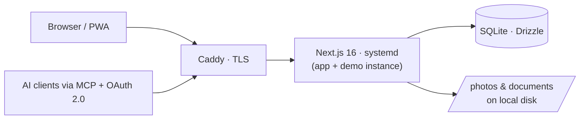

# Loggen

A personal life dashboard — daily logging, health metrics, nutrition, training,
job search tracking, recipes and planning — fully self-hosted on my own
hardware, with an AI assistant wired in through MCP.

**Live demo:** [demo.loggen.app](https://demo.loggen.app) — fictional data,
resets nightly. The UI is in Danish (it's a personal app for a Danish user);
the code and this README are in English where it matters.

> **Note on reuse:** This repository is public as a portfolio piece. There is
> deliberately no open source license — all rights reserved. You're welcome to
> read the code; please don't redeploy it.

## Why it exists

Loggen stores health data, job applications and daily notes — the most
personal data I have. The project started on Vercel + Turso and was then
deliberately migrated to a single small machine in my apartment: one Ubuntu
server, one SQLite file, files on local disk, TLS via Caddy. No third party
has technical access to the data. That constraint shaped most of the
architecture below.

## What it does

- **Daily log** (`/today`) — mood, energy, sleep, weight, macros (with
  fiber handled per EU labelling rules), supplements, fasting, alcohol,
  free-form notes. Everything autosaves; only changed fields are written, and
  the form adopts server-side changes on focus so an AI writing via MCP and a
  stale browser tab can't overwrite each other.
- **Planner** — recurring plan items (projects, supplements, training,
  nutrition targets, meals) with weekday sets, fixed-rhythm intervals
  ("every N days") and monthly schedules. Occurrences are computed at read
  time, never materialised. Nutrition targets are *ranges* (min/max per
  macro) with automatic completion when the day lands inside every bound.
- **Health** (`/health`) — calendar view over every metric, Garmin sleep
  import (CSV), photo tracking, custom user-defined parameters.
- **Training** — free-text workout sessions with a lenient parser
  (exercises, sets×reps @ weight), templates, and per-exercise progression
  charts (estimated 1RM via the Epley formula).
- **Job search** (`/jobs`) — applications with status timeline, documents,
  weekly goals that inherit from previous weeks, automatic "no response"
  flagging after two months.
- **Recipes** — with per-portion macros, portion scaling, and read-only
  share links (CSPRNG tokens, revocable, `noindex`).
- **Statistics** (`/statistik`) — charts and calendar heatmaps across every
  tracked metric.
- **Backup** — full ZIP export (database + files) and transactional import
  with referential integrity validated before anything is deleted.
- Installable as a PWA; mobile-first UI (40px tap targets, decimal-comma
  inputs).

## The AI integration

The app exposes an MCP server at `/api/mcp` with **63 tools** across daily
entries, planning, supplements, workouts, recipes, job applications,
documents and statistics — so an AI assistant (Claude, ChatGPT) can log
"12 g glycine" or answer "what's on my plan today?" in natural language.

Auth for MCP clients is a **self-written OAuth 2.0 authorization server**:

- Authorization-code flow with **mandatory PKCE (S256 only)**
- Client secrets stored as bcrypt hashes; tokens stored as SHA-256 hashes
- Atomic single-use auth codes (`DELETE … RETURNING`)
- Rate-limited token endpoint with uniform errors (no client enumeration)
- Issuer metadata pinned to an `APP_ORIGIN` env — never derived from
  forwarded headers

Each MCP request gets its own server instance inside `AsyncLocalStorage`;
the user is resolved per tool call, so no state is shared between requests.

## Architecture



| Layer | Choice |
|---|---|
| Framework | Next.js 16 (App Router, server actions), React 19, TypeScript |
| Data | SQLite via libSQL, Drizzle ORM, hand-reviewed migrations |
| Auth | Auth.js magic-link (Resend) for the browser; own OAuth 2.0 server for MCP |
| Styling | Tailwind CSS v4 (CSS-variable theme, light/dark), Lucide icons |
| Hosting | Ubuntu on a Lenovo ThinkCentre M920q, Caddy + Let's Encrypt, systemd, LUKS full-disk encryption, dynamic DNS via a systemd timer |

Engineering choices worth a look:

- **Every server action re-authenticates.** Each exported action calls
  `requireUser()` and every query is scoped with `eq(table.userId, user.id)` —
  treated as public HTTP endpoints, because that's what they are.
- **Integer arithmetic for decimals.** Weights, hours and doses are stored
  as ×10/×100 integers end to end; no floating point drift in health data.
- **Partial writes everywhere it matters.** Day entries, week goals and day
  goals use "only send what changed" semantics so concurrent writers (the
  app, the AI, a second device) never clobber each other.
- **Defense in depth on file paths.** Backup imports validate blob paths
  against a strict schema, *and* the file layer independently asserts
  containment under the data root.
- The codebase has been through an external security review; every finding
  is fixed or consciously accepted, in both cases traceable in the commit
  history (`security:`-prefixed commits).

## Running it locally

```bash
git clone https://github.com/CasperHavelykke/log.git
cd log
npm install
cp .env.local.example .env.local   # fill in the secrets (see comments)
npm run db:migrate                 # creates data/app.db
npm run dev
```

Requires Node 20+. Login uses magic links via Resend — with Resend's sandbox
sender you can only mail your own account, which is fine for local use.

## Deployment

One small script (`scripts/deploy.sh`): pull, install, build, migrate both
databases (production + demo), restart both systemd services. The demo
instance runs from the same build with its own database and data directory,
and reseeds nightly.

## Status

Actively developed and used daily — the commit history *is* the changelog.
Next on the list: a test suite + CI gate (the OAuth flow and the
import/export round-trip first), and a strict CSP.

---

Built by **Casper Havelykke** — [loggen.app](https://loggen.app)
